  

<!--
  Deliberately does not restate the name, field, or country. The banner above
  carries the field, and the introduction below carries the rest, so this line
  is the one place that says what the work is for.
-->

<h4 align="center">Building AI that runs on the device, not in the cloud.</h4>

  
  
  
  
  

  
  
  
  

  
  
  
  
  
  

 

  
  
  
  

 

### Hi, I'm Ihsan 👋

I'm a Computer Science undergraduate from Indonesia. I work on computer vision, NLP, and edge AI — mostly getting models to run on small hardware, so they keep working without a network.

I also shoot photos, work on audio, and build mobile apps, and a lot of my projects sit between those and ML.

- 🔭 Exploring on-device LLM efficiency and multimodal edge AI.
- 🤝 Open to internships and collaborations in Edge AI / MLOps.
- 📫 [Get in touch](mailto:huftrash@gmail.com)

<!--
  Two details worth adding once you want them public — a recruiter filters on both:
    1. University: change the line at the top to
       "Computer Science undergraduate at <University>, Indonesia"
    2. Availability: extend the internships bullet with
       "— available <month year> to <month year>"
-->

<h2 align="center">Featured Projects</h2>

<table>
<tr>
<td width="50%" valign="top">

### [Echo](https://github.com/Ihsan-p1/Echo)

Context-aware interactive robot assistant on a hybrid laptop–RPi architecture — CUDA inference on the laptop, a Raspberry Pi 4 driving camera, audio I/O and hardware control. Fuses voice, vision, and gesture into one multimodal brain.

</td>
<td width="50%" valign="top">

### [Sentra](https://github.com/Ihsan-p1/Sentra)

RAG chatbot for media-framing analysis of Indonesian English-language news. Runs fully local — a 3B LLM on Ollama, local embeddings, PostgreSQL, no external API at inference.

Every answer is scored twice, trained model against a rule-based baseline, side by side. That comparison is the point: it keeps the cost of the simple heuristic visible instead of assuming the trained model wins.

</td>
</tr>
<tr>
<td width="50%" valign="top">

### [InfraSight](https://github.com/Ihsan-p1/InfraSight)

Pothole volumetric analysis for road maintenance. Combines monocular depth estimation with instance segmentation to measure pothole volume from a single camera.

</td>
<td width="50%" valign="top">

### [EchoKeeper](https://github.com/Ihsan-p1/Echokeeper)

High-performance local translation engine built on Meta's NLLB-200 — 200 languages, executed entirely on your own hardware. No data leaves the machine.

</td>
</tr>
<tr>
<td width="50%" valign="top">

### [MediSight-AI](https://github.com/Ihsan-p1/MediSight-AI)

Real-time multi-modal facial analysis from a webcam — emotion, drowsiness, and a pain proxy.

The first published numbers were wrong and I said so: `random_split` had put near-duplicate frames of the same person in both train and test, inflating everything. Withdrawn, rebuilt, and re-measured on a subject-disjoint split.

</td>
<td width="50%" valign="top">

### [ShoreLine](https://github.com/Ihsan-p1/ShoreLine)

Keyboard-first desktop app for culling large photo shoots fast. Built for my own photography workflow, where the bottleneck is the first pass, not the editing.

</td>
</tr>
</table>

<h2 align="center">Profile Analysis</h2>

<!--
  Cards below are generated daily by .github/workflows/profile-cards.yml and
  committed to the `cards` branch, then served from raw.githubusercontent.com.
  Nothing here depends on a third-party host at page-load time, which is what
  used to break the old github-readme-stats cards.
-->

<!--
  Each cell is pinned to half the table and each image to the full cell, so the
  four cards form an even grid. Without this the cards fall back to their own
  natural widths, which differ per card and leave the columns ragged.
-->

<table align="center" width="100%">
<tr>
<td width="50%" valign="top"></td>
<td width="50%" valign="top"></td>
</tr>
<tr>
<td width="50%" valign="top"></td>
<td width="50%" valign="top"></td>
</tr>
</table>

<h2 align="center">Contributions</h2>

<picture>
  <source media="(prefers-color-scheme: dark)" srcset="https://raw.githubusercontent.com/Ihsan-p1/Ihsan-p1/output/snake-dark.svg" />
  <source media="(prefers-color-scheme: light)" srcset="https://raw.githubusercontent.com/Ihsan-p1/Ihsan-p1/output/snake.svg" />
  
</picture>
